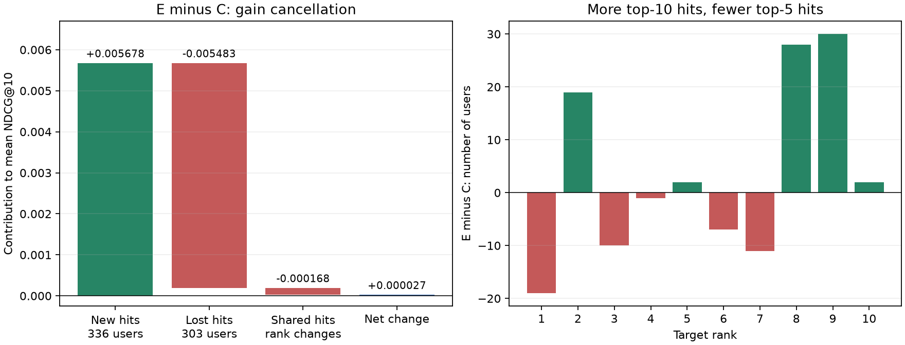

# E 冻结推理：覆盖收益与排名损失的配对分解

## 结论

2026-09-17 核验用户已完成的 E 推理，并对22363名用户逐一配对：E相对C新增336次命中、丢失303次，净增33；但新增命中的平均排名更靠后，共同命中用户的排名变化另有净损失，最终NDCG几乎持平。这个结果将上一轮“为什么Recall改善但NDCG没有改善”的未知收敛成了可直接核算的收益抵消。

这不是门控可靠性已经得到证明。E/A/C使用独立训练得到的参数；E与C差异包含共同训练后表示、query、层级偏置和门控的变化，不能将全部命中变化归因为推理时动态项本身。

E仍未达到预定主方法门槛，当前不提升其为默认方法，不追加训练、E/off、正式常量校准或新的消融矩阵。本轮结果未证明状态门控普遍无效，但不支持只增加门控容量或仅追求更多路径存活。

## Run、lineage 与产物

- E推理：[2akcpdl1](https://wandb.ai/baymaxam/GRID/runs/2akcpdl1)，state=finished，notes与单次推理命令一致；evaluation、beam10、seed42、devices=[0]、content_scoring=trained、gate_mode=dynamic。
- 实际使用E训练 `e1hegvxf` 的best checkpoint，step19000，artifact ID=`QXJ0aWZhY3Q6MzYzMDEwNTc3Nw==`，digest=`6c0d83f27d5d88cdc9d3637bfc875d9c`。
- E prediction artifact ID=`QXJ0aWZhY3Q6MzYzMDIzNzA5Mw==`，digest=`a13e90291058a9b1c9767ef71efa123c`，`merged_predictions_tensor.pt`，7337141 bytes。
- E trace artifact ID=`QXJ0aWZhY3Q6MzYzMDIzNzUyMg==`，digest=`b75775d922673add58b636298c877e44`，`prefix_trace.pt`，5730779 bytes。
- C复用此前已核验的 [e0t8l1oa](https://wandb.ai/baymaxam/GRID/runs/e0t8l1oa) 预测/trace缓存；训练来源k6jvoo2v best step19000。A复用此前已核验的n5rv1dgm逐用户证据。没有重复执行A/C模型。
- E/C上游SID、embedding实际artifact ID/digest一致；完整data配置相同，catalog fingerprint一致。E metadata记录门控版本、停止梯度的三维特征、dynamic、无固定常量、labels_used_for_scoring=false。
- 重新断言E/C预测与trace的用户顺序、唯一用户、完整目标SID、合法目录候选和rank一致；每用户10个唯一物品；目标路径没有消失后复活；A用户及目标SID与E/C对齐。历史原始输入序列字节没有重新核验。

## 统一 evaluation 复算

| 模型 | NDCG@10 | Hit@10 | 命中人数 | NDCG@5 | Top5命中人数 |
| --- | ---: | ---: | ---: | ---: | ---: |
| A | 0.042576128 | 0.080042928 | 1790 | 0.033878914 | 1189 |
| C | 0.041375760 | 0.077449358 | 1732 | 0.032904163 | 1148 |
| E | 0.041403154 | 0.078925010 | 1765 | 0.032382350 | 1139 |

这里使用唯一用户的完整预测复算，没有混入上一轮双卡训练validation日志。E/C的NDCG相对变化为+0.06621%，Hit为+1.90531%；E/A分别为−2.75500%、−1.39665%。训练日志中的+0.00668%和+1.831%属于另一统计口径，不能直接替换。

## 为什么净多33次命中却几乎没有NDCG增益

E相对C的互斥用户集合：

- 新增命中336人，E平均排名6.679，其中112人在Top5。
- 丢失命中303人，C原平均排名6.092，其中118人在Top5。
- 共同命中1429人：487人排名上升，468人下降，474人不变。尽管上升人数略多，折损后的排名收益总和仍为负；变化幅度和发生位置决定NDCG，不能仅比较人数。

对总体平均NDCG的严格加法分解：

| 来源 | NDCG@10贡献 |
| --- | ---: |
| 336名新增命中 | +0.005677958 |
| 303名丢失命中 | −0.005482505 |
| 1429名共同命中的排名变化 | −0.000168059 |
| 合计 | +0.000027395 |

新增/丢失命中相抵后仅余+0.000195453，再被共同命中排名损失抵消约85.98%。该分解是观测到的精确指标恒等式，不是动态门控的因果归因。

直接看排名数量：Top5少9人，6–10名多42人，合计Top10多33人；rank1从329降至310。于是“覆盖改善集中于后排，同时高位排名价值受损”在这对模型上有了直接证据。

## 不确定性与A基线

| 配对差值 | 新增/丢失命中 | NDCG绝对差 | 95%配对区间 | Hit绝对差95%区间 |
| --- | --- | ---: | --- | --- |
| E−C | 336 / 303 | +0.000027395 | [−0.001553059, +0.001688893] | [−0.001431283, +0.004459488] |
| E−A | 413 / 438 | −0.001172974 | [−0.003269841, +0.001024452] | [−0.004769327, +0.002687074] |

沿用预定bootstrap：目标SID前两层聚类，5401簇，2000次配对重采样，seed42；NDCG与Hit使用相同簇抽样。两个指标的区间均跨零，未建立稳定提升，也不能称E显著差于A。区间只描述当前evaluation用户/前缀重采样不确定性，不覆盖训练seed变化；evaluation已用于checkpoint选择，不能作为独立最终测试。

## 路径与频率分组的辅助证据

| 层级 | C目标路径存活 | E目标路径存活 | E−C |
| --- | ---: | ---: | ---: |
| 1 | 8368 | 8344 | −24 |
| 2 | 3010 | 3005 | −5 |
| 3 | 2081 | 2101 | +20 |
| 4 / 最终 | 1732 | 1765 | +33 |

前两层总体覆盖没有提高，净改善出现在后两层；不能据此宣称早期路由瓶颈已被修复。第2层E新增存活385、丢失390，其中分别有214个E最终命中和192个C最终命中，但这些层级子集重叠，不能跨层相加。E/C每用户平均共享6.151个Top10候选，预测变化较广；低候选重合不等于更好。

频率分组命中数：Head为E1578/C1542/A1574，Mid为E142/C153/A165，Tail+Cold为E45/C37/A51。相对C的净33次命中由Head+36、Mid−11、Tail+Cold+8组成。长尾点估计改善仍未超过A，且样本小；不据此改写为已证实的长尾方法。

## 下一步边界

这次单次推理已回答预定问题，暂不追加实验。保留A的已观察到的内容初始化收益，C为复杂分支参考，E为尚未达标的候选。

如果继续修正E，下一份设计需要明确说明：如何减少高位命中丢失或共同命中的排序损失，以及为何在不依赖evaluation标签的情况下可以实现。当前证据只定位到可观察的收益抵消，尚未证明某个ranking loss、阈值、冻结策略或更大门控能够解决它；不能据此直接再开训练。

## 可复核材料与操作

- `tmp/cgbs_e_inference/runs.json`：本轮E在线config、notes、summary和完整artifact身份；scope为catalog_arm=content_init_state_gate且run_mode=inference，最新最多10条，本次返回1条。
- `tmp/cgbs_e_inference/analysis.json`：指标、配对区间、分组、逐层路径及贡献分解。
- 同目录 `E_users.csv`、`C_users.csv`、`A_users.csv` 和 `C_to_E_rank_transition.csv`：完整逐用户和排名迁移证据。
- 采集脚本 `tmp/inspect_cgbs_e_inference.py`；复算 `uv run python -m tmp.analyze_cgbs_e_inference`，使用项目bundle/trace loader，通过上述一致性断言。
- 本轮仅下载和统计已发布产物，没有执行模型、创建正式diagnosis run或修改W&B记录；未修改生产代码、未提交Git。没有运行与本次文档统计无关的测试矩阵。
