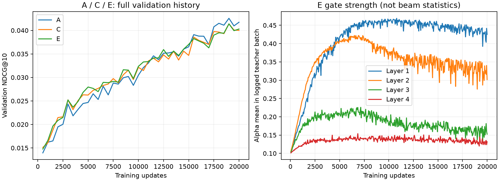

# CGBS E：状态门控首轮训练结果

后续状态：单次E evaluation推理已完成，逐用户结果见 [inference-outcome.md](inference-outcome.md)。净增命中被新增命中排名偏后及共同命中的排序损失抵消；未达到机制晋级门槛。下文保留原训练口径，不与推理复算数字混用。

## 结论与决策

2026-09-17 在线读取 W&B 后确认：E 正常完成，最佳 NDCG@10 与 C 基本持平（相对 +0.00668%，绝对 +0.000002764），对应 Recall@10 相对 +1.831%；仍低于 A（NDCG −2.763%，Recall −1.403%）。这是覆盖改善的候选信号，没有建立总体推荐质量收益，也没有达到预定的“超过 A/C 且 Hit 不下降”机制验证门槛。

本轮没有出现 D 式的大幅退化，但不能把数值上略高于 C 的 NDCG 宣称为实质进步。保持 A 为质量基准、C 为复杂分支参考，E 保留为有覆盖信号的候选。暂不进入正式常量校准、动态/常量实验矩阵或新增训练，不自动扩展 MLP、特征或 seed。此决策针对当前参数化和预算，不证明所有状态门控无效。

## 正式身份与可比性

- E：[e1hegvxf](https://wandb.ai/baymaxam/GRID/runs/e1hegvxf)，state=`finished`，arm=`content_init_state_gate`，revision=`state-gate-v1`，notes 与交付命令一致。
- seed42、devices=[0,1]、strategy=ddp、precision=32-true、每卡训练 batch128、20k steps、40次验证；`dry_run=false`、`ckpt_path=null`、gate_mode=dynamic。最终日志 global_step=19999 对应20000次更新。runtime metadata 的 host=node1；gpu_count=8 是主机可见设备信息，不能解释为本次使用8卡。
- C/E 完整配置递归比较：除 arm、gate mode、新增统计、运行身份/路径/notes和机制版本外，其余相同。data、优化器、训练预算、验证和 checkpoint 选择规则一致。没有复核训练时源码 hash 或原始序列文件字节。
- A/C/E 实际使用的上游 artifact ID/digest 一致：SID `rkmeans_inference-semantic-id:v2`，ID `QXJ0aWZhY3Q6MzQ0MDQ2NjExMQ==`，digest `20f08b323a286fbb3f16b5ea27562af1`；embedding `sem_embeds_inference-semantic-embedding:v5`，ID `QXJ0aWZhY3Q6MzQzOTg1ODUxMQ==`，digest `ab56af975eac589c27eed6094482cbd7`。
- E checkpoint：`tiger_catalog_grounded_content_init_state_gate_beauty_train-checkpoint:v0`，ID `QXJ0aWZhY3Q6MzYzMDEwNTc3Nw==`，digest `6c0d83f27d5d88cdc9d3637bfc875d9c`；文件 `checkpoint_epoch=000_step=019000.ckpt`，84812469 bytes。
- checkpoint metadata 为 selection=best、monitor=val/ndcg@10、mode=max，best_model_score 与完整验证曲线最大值一致。本轮读取了 metadata 和文件清单，没有下载或加载 checkpoint 张量。

## 同口径验证结果

| 条件 | best NDCG@10 | 对应 Recall@10 | 最后5次 NDCG 均值 |
| --- | ---: | ---: | ---: |
| A 内容初始化：[5g3wpbg7](https://wandb.ai/baymaxam/GRID/runs/5g3wpbg7) | 0.042569727 | 0.080033332 | 0.041577636 |
| C 完整分支：[k6jvoo2v](https://wandb.ai/baymaxam/GRID/runs/k6jvoo2v) | 0.041390747 | 0.077491172 | 0.040083681 |
| E 状态门控：[e1hegvxf](https://wandb.ai/baymaxam/GRID/runs/e1hegvxf) | 0.041393511 | 0.078910127 | 0.040104003 |

三者最佳点均为19000 updates；Recall取同一 NDCG 最佳点，不单独选择 Recall 峰值。在单目标设置下 Recall 对应 Hit，但这里是原训练验证日志口径，没有将其换算成去重后的整数命中用户数。E 的最终 summary NDCG=0.040289998，不是 best 值。

- E/C：最佳 NDCG 相对 +0.00668%，对应 Recall +1.83112%；末5次 NDCG 均值仅 +0.05070%。因此“基本持平”也获得末段曲线支持。
- E/A：最佳 NDCG −2.76303%，对应 Recall −1.40342%；末5次均值 −3.54429%。
- E 在40个对应验证点中25次 NDCG 高于 C、28次高于 A；但15k–20k的11个点中仅4次高于 C、1次高于 A。早期优势没有形成训练末期对 A 的稳定优势。
- 验证点彼此相关，不能当作40次独立实验。本轮没有新 seed、逐用户配对置信区间或独立测试集，不能宣称 Recall 提升具有统计显著性。

## 门控是否学到状态差异

完整读取400个已记录训练 batch 的门控日志，各层在所有这些 batch 内都有非零 alpha 范围（max−min > 1e-6）。因此观察到的门控并非一直停留于零初始化对应的层级常量。

19000 updates 对应训练日志中的统计如下，显示的是该次训练前向的 teacher 状态，不是重新加载 best checkpoint 后的全量校准：

| 层级（文中从1计数） | alpha mean | min | max |
| --- | ---: | ---: | ---: |
| 1 | 0.42371 | 0.32356 | 0.46219 |
| 2 | 0.27555 | 0.10364 | 0.41270 |
| 3 | 0.13738 | 0.07625 | 0.30302 |
| 4 | 0.13310 | 0.10409 | 0.23890 |

MetricCallback每个训练batch更新、计算并reset；W&B每50步记录一次。因此这些均值和范围不是整个训练窗口、完整数据集或真实beam状态的统计，更不能直接用作正式 fixed alpha。

该证据支持“机制被执行并产生状态差异”，不支持“差异反映正确的分支可靠性”。均值较高也不等于内容更可靠；teacher状态与beam访问状态存在分布差异。

Recall改善而NDCG持平与“新增命中排名偏后、同时存在头部排序损失”等情况相容，但聚合指标无法区分这些解释。当前没有 E 的逐用户预测，不把任何一种解释写成已经证实的瓶颈。

## 下一步建议与边界

按原判据，本轮结束于“尚未建立主指标收益”，不提升E为主方法，不以覆盖信号替换原有成功标准。停止自动追加训练，保留候选、完整曲线和checkpoint。

如果用户希望进一步解释这次 +1.83% Recall 的来源，最小后续工作可限定为一次 E best checkpoint 的 evaluation 推理，复用已有 C/A 预测做逐用户命中/排名配对；这属于有明确问题的可选诊断，尚未执行，也不等于已经获准进入常量机制验证。应先回答新增/丢失命中与排名收益是否值得追踪，再决定是否修改门控。

## 证据与操作记录

- W&B Public API，project=`baymaxam/GRID`，发现过滤为 `config.catalog_arm=content_init_state_gate` 且 `config.run_mode=train`，最多读取最新10条，本次返回1条E；随后精确读取 A/C/E 指定 run。
- 通过 `scan_history` 读取各run全部40个非空验证记录和E全部400个已记录门控batch，无曲线采样；没有将未记录的训练batch补成观测。
- 在线快照：`tmp/cgbs_gate_outcome/runs.json`；数值与完整配置差异：`tmp/cgbs_gate_outcome/analysis.json`；采集时间2026-09-16T17:02:31Z（北京时间2026-09-17）。
- 未修改生产代码、未修改W&B记录、未启动完整实验或创建Git commit。正式常量校准仍未实施。
