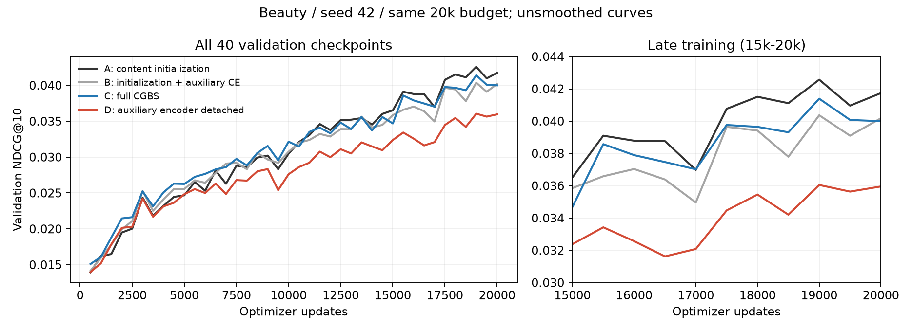

# CGBS D：辅助编码器梯度隔离结果

后续状态：原 C 的 trained/off 已完成，结果见 [C 冻结开关分析](../validate-cgbs-content-routing-mechanism/c-screen-outcome.md)。下文“尚无冻结推理”是本轮 D 结果采集时的历史状态。

## 结论

2026-09-16 在线核验 W&B：D 正常完成，但在 Beauty / seed42 / 20k updates 下退化。相对 C，best validation NDCG@10 为 −12.915%；相对 A 为 −15.327%。40 个对应验证点中 D 从未超过 C，最后 5 次均值同样下降。因此本次“完全移除辅助 CE 对编码器的直接梯度”修正未获得支持，不应作为后续默认模型，也不应直接围绕它启动更多训练。

这修正了上一轮优先研究梯度隔离的判断；不把负结果转述为该修正成功。CGBS 路线保持，原 C 作为复杂分支的当前参考，A 作为总体质量参考。不能从 D 的负结果推导不存在局部梯度冲突，也不能直接证明部分隔离、动态门控等方案有效。

## 实验身份和可比性

- D：[ot2web0o](https://wandb.ai/baymaxam/GRID/runs/ot2web0o)，state=`finished`，真实 arm=`content_init_full_aux_detached`。
- revision=`aux-encoder-stop-gradient-v1`，reference=`k6jvoo2v`，baseline=`5g3wpbg7`；notes 与交付命令一致。
- seed42、devices=[0,1]、20k steps、40 次验证、每卡 batch128、ckpt_path=null、beam10。最终日志 global_step=19999，对应完成 20000 次更新。
- C/D 的完整 model config 去掉 arm 后相同，data config 相同，trainer 去掉输出目录后相同，checkpoint 配置仅 dirpath 不同。未发现所核验配置中的预算或模型参数混杂；未核验历史原始数据字节或训练时源码哈希。
- 两者实际使用的 artifact ID 和 digest 完全相同：SID `rkmeans_inference-semantic-id:v2`，ID `QXJ0aWZhY3Q6MzQ0MDQ2NjExMQ==`，digest `20f08b323a286fbb3f16b5ea27562af1`；embedding `sem_embeds_inference-semantic-embedding:v5`，ID `QXJ0aWZhY3Q6MzQzOTg1ODUxMQ==`，digest `ab56af975eac589c27eed6094482cbd7`。
- D best checkpoint artifact：`tiger_catalog_grounded_content_init_full_aux_detached_beauty_train-checkpoint:v0`，ID `QXJ0aWZhY3Q6MzYyODQwNTAxOQ==`，digest `499c81944ec32f0d3a7964e441c21559`；文件 `checkpoint_epoch=000_step=019000.ckpt`，84811005 bytes。
- checkpoint metadata 的 selection=best、monitor=val/ndcg@10，best_model_score 与完整曲线最大值一致。本轮读取 metadata 和文件清单，未加载 D checkpoint 张量。

## 相同 validation 口径

| 条件 | run | best NDCG@10 | 对应 Recall@10 | 最后 5 次 NDCG 均值 |
| --- | --- | ---: | ---: | ---: |
| A 内容初始化 | [5g3wpbg7](https://wandb.ai/baymaxam/GRID/runs/5g3wpbg7) | 0.042569727 | 0.080033332 | 0.041577636 |
| B 初始化 + 辅助 CE | [z98fozox](https://wandb.ai/baymaxam/GRID/runs/z98fozox) | 0.040364187 | 0.076055847 | 0.039370181 |
| C 完整 CGBS | [k6jvoo2v](https://wandb.ai/baymaxam/GRID/runs/k6jvoo2v) | 0.041390747 | 0.077491172 | 0.040083681 |
| D 辅助编码器梯度隔离 | [ot2web0o](https://wandb.ai/baymaxam/GRID/runs/ot2web0o) | 0.036045112 | 0.069121912 | 0.035458553 |

四者 best checkpoint 均在 19000 updates。Recall 是对应 best NDCG 记录的 Recall，未单独挑选 Recall 峰值。W&B summary 的 val/ndcg@10 是最后一次值，D 为 0.035953261，不是表中的 best 值。

- D/C：best NDCG −12.915%，对应 Recall −10.800%，末 5 次 NDCG 均值 −11.539%。
- D/A：best NDCG −15.327%，对应 Recall −13.634%，末 5 次均值 −14.717%。
- 40 个配对验证点，D 高于 C 为 0/40，高于 A 为 5/40；15k–20k 的 11 个点，D 高于 A/B/C 均为 0/11。
- 验证点彼此相关，不是 40 个独立实验。这里没有多 seed 或逐用户置信区间，不能声称统计显著。



## 机制解释

观察：D 的最终记录 train/content_loss=8.5991，高于 C 的 8.4848；mixed generation loss=1.9133，高于 C 的 1.8838。平均 mixture alpha 仍为 0.2144（C 为 0.2229）。这些数字没有显示出隔离后整体优化改善，但 mixed loss 不是独立纯 token loss，平均 alpha 也不等于内容分支有效性。

合理推断：原 C 中辅助监督对共享表示的适配可能具有有益作用；完全切断后，query MLP 难以补偿表示变化。这个解释与结果相容，但本轮没有共享梯度夹角、纯 token 评估或冻结干预，不能把它写成已证实机制。

不能继续主张“辅助梯度只是有害，应当移除”；也不能从 B<A 和 D<C 的组合直接推导最优梯度系数。两者共同提示需要先分离在线路由贡献与联合训练作用。

## 下一步：仅补齐原 C 的冻结开关对照

本次在线查询 `catalog_arm` 为 B/C/D 且 run_mode 非 train 的运行，结果为空。现有证据缺少原 C 的 trained/off 对照。先做原 C 的 2 次冻结推理，比同时展开 C/D 四次或继续训练更直接回答“目前完整分支到底在帮忙还是拖累”。该结果用于确定 CGBS 内部修正位置，不作为换主方法的开关。

从 node1 仓库根目录执行，物理 GPU0、单进程、不训练：

```bash
bash ./tiger_catalog_grounded_mechanism_inference.sh \
  --data-dir data/beauty \
  --condition c \
  --stage screen \
  --checkpoint-path 'wandb://baymaxam/GRID/k6jvoo2v?role=checkpoint&file=checkpoint_epoch=000_step=019000.ckpt' \
  --notes "CGBS C mechanism screen after D negative result; frozen best step19000; paired trained versus off"
```

- C/trained 优于 C/off：支持原 C 当前 checkpoint 上在线路由有净帮助，但仍需解释 C 未超过 A；下一修正应保留已获支持的路径。
- C/trained 低于 C/off：在线混合存在净损害，再检查逐用户获益/受损和目标前缀存活，决定是否有调整混合机制的证据。
- 两者接近：在线贡献有限；不立即以更复杂门控或新训练解释这一空缺。

该命令生成 prediction/trace 产物；之后核验运行和产物，再按既有分析协议完成配对评估。本轮未启动完整推理或诊断。D 的 screen 暂后置，不追加 seed、Sports、signal 或调参矩阵。

## 可复核文件

- 在线快照：`tmp/cgbs_aux_detached_outcome/runs.json`，含采集时间、完整 config/history/summary/notes、输入及 checkpoint 身份。
- 数值与配置对照：`tmp/cgbs_aux_detached_outcome/comparison.json`。
- 已有冻结推理查询：`tmp/cgbs_aux_detached_outcome/existing_inference.json`（本次为空）。
- 采集、分析和作图：`tmp/inspect_cgbs_detached_outcome.py`、`tmp/analyze_cgbs_detached_outcome.py`、`tmp/plot_cgbs_detached_outcome.py`。只处理现有记录，不创建 W&B run。
