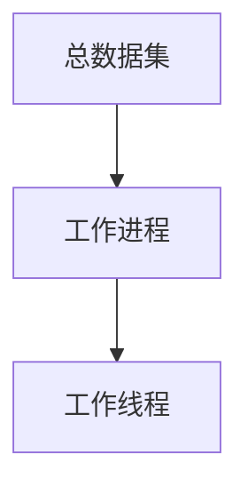

## 数据加载

数据加载模块实现了分布式多线程的加载逻辑，数据加载体系如下

### 工作进程

由distributed创建，通常一个设备(GPU)上运行一个进程

关键参数:

- world_size: 进程数
- global_rank: 进程全局id

数据集会根据进程数被分配一次，具体实现如下:

- `sequence_datamodule.SequenceDataModule.setup`
- `sequence_datamodule.SequenceDataModule.get_dataloader`

### 工作线程

由`DataLoader`创建加载数据的子线程

关键参数:

- num_workers: 线程数
- global_dataloader_workerid: 该值等于`global_rank * num_workers + worker_id`

模块中的`batch_size_per_device`和`iterate_per_row`影响dataloader的加载逻辑

- batch_size_per_device: batch_size，批次大小
- iterate_per_row: 是否按行迭代，即dataloader每次迭代一个样本

dataloader使用多线程时，主线程使用一个收集队列从worker的生产队列中收集数据，当收集够`batch_size`条数据时，触发`collate_fn`函数执行拼接逻辑

当`iterate_per_row`为true时，调用Iterator(`TFRecordIterator`)的`iterrows`，返回形如`list[sample]`的迭代器

此时，worker生产队列中的元素是单个样本，样本的批量拼接由dataloader完成(具体来说是`collate_fn`函数)，由`batch_size`控制大小

当`iterate_per_row`为false时，调用`iter_batches`方法，返回类似`list[batch]`的迭代器

此时，worker生产队列中的元素是一个批量的样本，样本的批量拼接由worker在加载数据时完成(在iterator的`iter_batches`函数中实现)，由`batch_size`控制大小。
而dataloader中的`batch_size`必须设置为`None`，表示`collate_fn`中不需要拼接样本，只需要封装即可